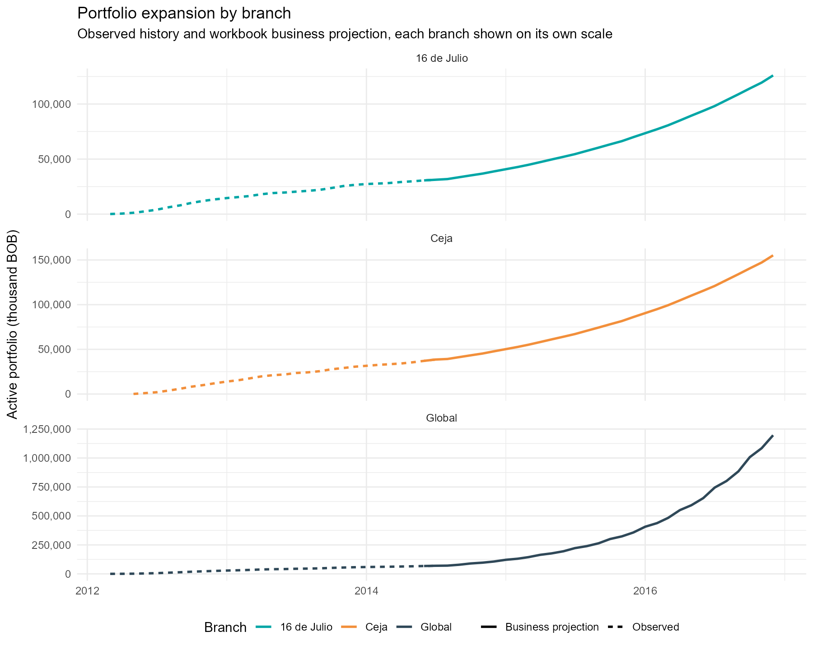
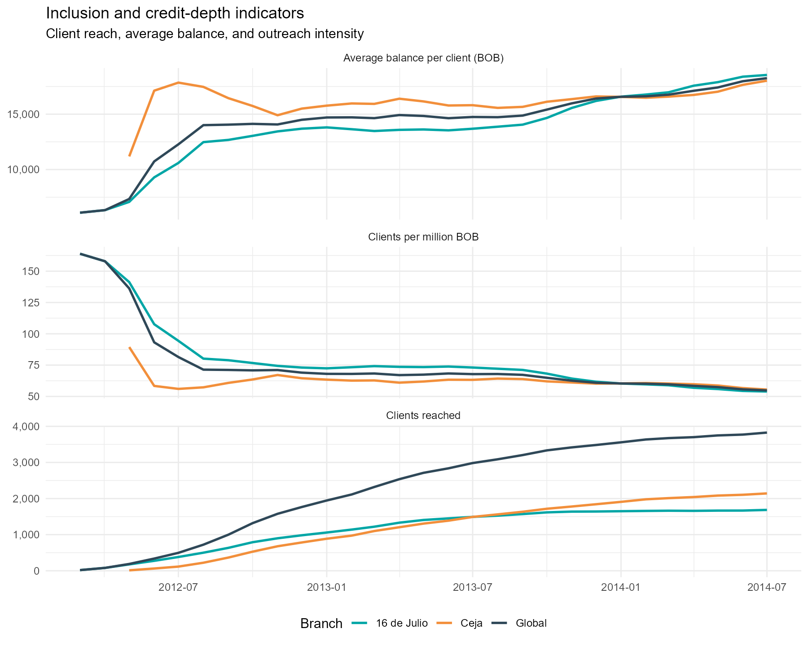
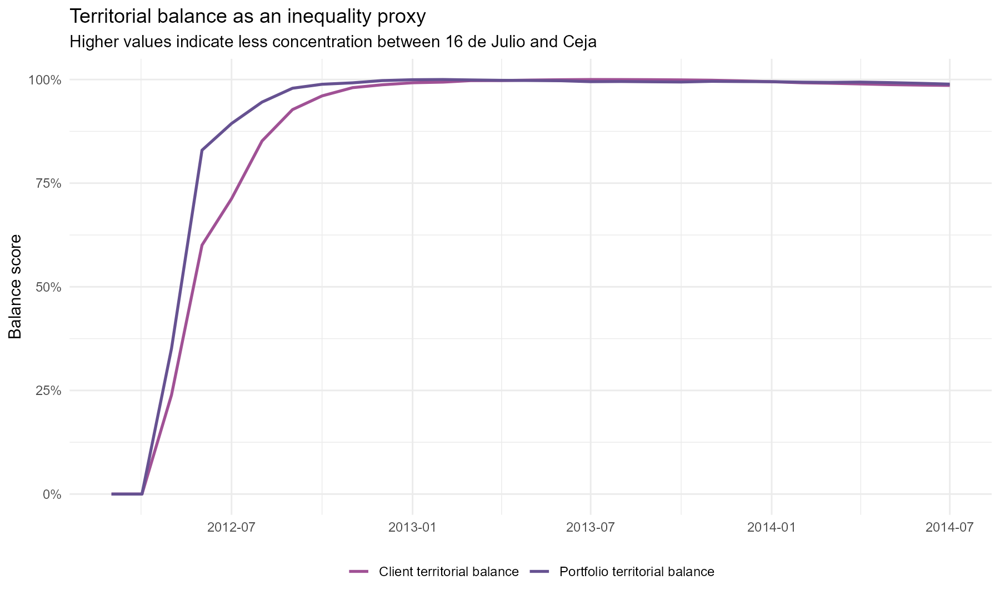
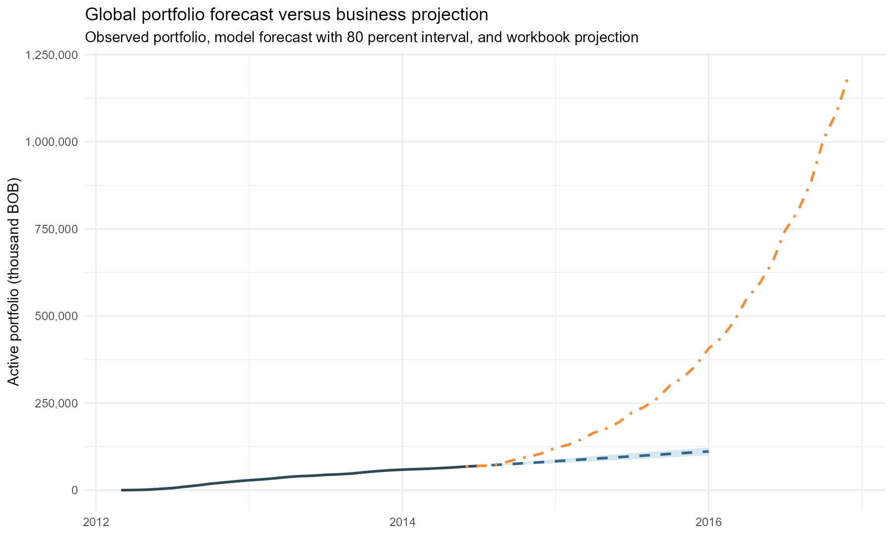
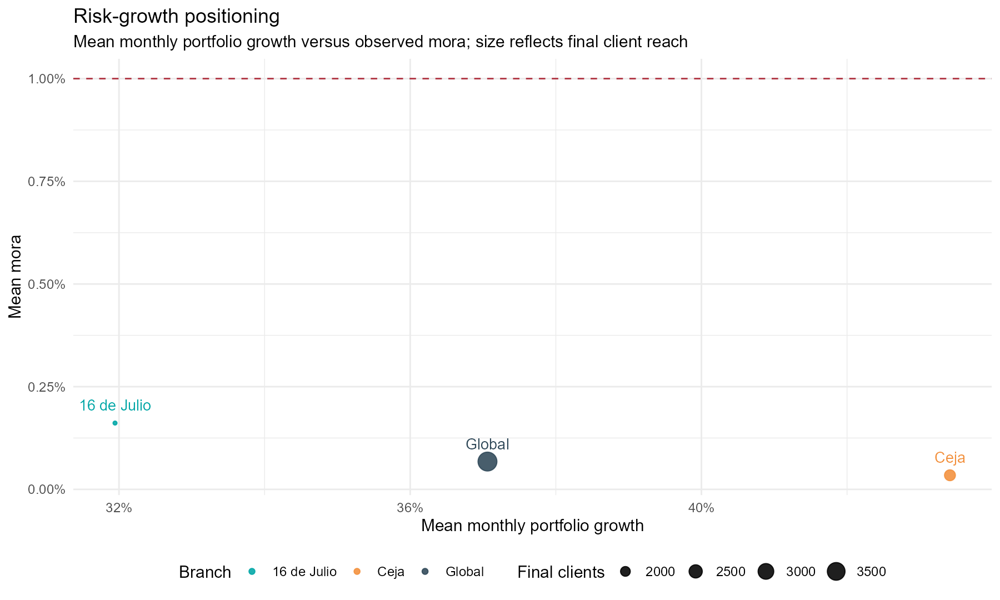
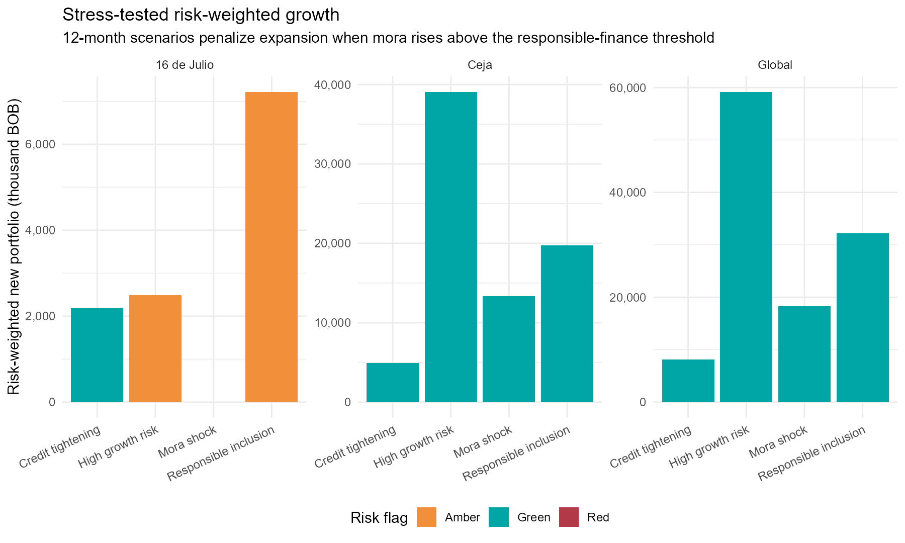

# Inclusive Credit Risk Analytics Bolivia

**Responsible financial-inclusion analytics, credit-risk monitoring and reproducible decision-support tools for Bolivia**

[](#reproduce)
[](PRIVACY.md)
[](docs/development_lens.md)
[](https://monicact.github.io/InclusiveCreditRiskAnalytics-Bolivia/)

[](https://monicact.github.io/InclusiveCreditRiskAnalytics-Bolivia/)
[](https://monicact.github.io/InclusiveCreditRiskAnalytics-Bolivia/project-overview.html)
[](https://monicact.github.io/InclusiveCreditRiskAnalytics-Bolivia/research-note.html)
[](https://monicact.github.io/InclusiveCreditRiskAnalytics-Bolivia/technical-report.html)
[](docs/methodology.md)
[](#reproduce)

Professional portfolio project using branch-level microfinance data from Bolivia to analyze credit growth, risk, financial inclusion, territorial balance, portfolio forecasting and responsible decision support.

**Repository name:** `InclusiveCreditRiskAnalytics-Bolivia`

**Explore the live analytical dashboard:** [https://monicact.github.io/InclusiveCreditRiskAnalytics-Bolivia/](https://monicact.github.io/InclusiveCreditRiskAnalytics-Bolivia/)

**Public pages:** [Project overview](https://monicact.github.io/InclusiveCreditRiskAnalytics-Bolivia/project-overview.html) | [Research note](https://monicact.github.io/InclusiveCreditRiskAnalytics-Bolivia/research-note.html) | [Technical report](https://monicact.github.io/InclusiveCreditRiskAnalytics-Bolivia/technical-report.html)

## Portfolio classification

| Dimension | Classification |
|---|---|
| Primary Lab | Development Analytics Lab |
| Secondary Labs | Applied Economics Lab; Research Methods Lab; Business Intelligence Lab; Data Science Lab; Open Science Lab |
| Research domain | Financial inclusion, credit-risk analytics, branch-level development finance and portfolio monitoring |
| Research question | How can branch-level credit portfolio data be used to evaluate responsible financial inclusion, local development potential and inequality in access to formal credit? |
| Methods | Portfolio forecasting, stress testing, KPI design, territorial balance metrics, development interpretation and privacy-aware reporting |
| Tools | R, Quarto, GitHub Pages, reproducible pipeline, public dashboard and technical reports |
| Scientific status | Advanced applied research project; dashboard project; technical report; reproducible analytical pipeline |
| Portfolio role | Demonstrates responsible financial-inclusion analytics, territorial balance, credit-risk monitoring, forecasting, stress testing and reproducible decision-support tools using branch-level data from Bolivia. |

## Executive summary

This project transforms operational credit portfolio records into a structured analytical framework for understanding portfolio dynamics, financial inclusion patterns, territorial distribution, credit risk and portfolio sustainability.

Starting from heterogeneous Excel workbooks, the workflow builds a reproducible R-based pipeline that consolidates branch-level information into clean analytical datasets, generates performance indicators, validates forecasting models, evaluates risk scenarios and produces interactive visualizations and technical outputs for transparent analysis.

The analytical perspective focuses on responsible financial inclusion, territorial access to credit and the distribution of financial services across branches. Portfolio growth is examined alongside outreach, concentration patterns, credit depth and portfolio quality indicators, providing a multidimensional view of credit expansion and financial access. The analysis explicitly distinguishes observed evidence from broader socioeconomic outcomes, ensuring that interpretations remain consistent with the information available in the underlying data.

## Research question

How can branch-level credit portfolio data be used to evaluate responsible financial inclusion, local development potential and inequality in access to formal credit?

## Why this matters

The project connects data analytics with poverty, inequality and economic development. It treats credit access as a measurable financial inclusion channel: more clients, sustainable portfolio growth, balanced territorial access and controlled mora can support local economic activity. The analysis is explicit that these are development proxies, not causal proof of poverty reduction.

## Key results

- Observed period: 2012-03-01 to 2014-07-01.
- Global portfolio: 109.8 to 69,850.2 thousand BOB.
- Global clients: 18 to 3,827.
- Maximum observed global mora: 0.25%.
- Territorial client balance score improved from 0% to 99%.
- Responsible inclusion score, global final month: 98.2/100.
- Best global forecasting model by holdout error: ARIMA.

## Dashboard

The public dashboard is live through GitHub Pages: [Inclusive Credit Risk Analytics Bolivia](https://monicact.github.io/InclusiveCreditRiskAnalytics-Bolivia/).

It provides project overview material, research-note outputs, technical-report content and dashboard-ready figures built from the reproducible analytical workflow.

## Selected figures













## Methodology

1. Ingest Excel workbooks with `readxl`.
2. Convert branch sheets into a tidy monthly panel.
3. Separate observed records from business projection sheets.
4. Generate financial inclusion indicators: clients, average balance, disbursement per client and clients per million BOB.
5. Estimate territorial balance between 16 de Julio and Ceja using HHI-based concentration metrics.
6. Validate portfolio forecasts using Naive, ETS and ARIMA holdout backtests.
7. Compare statistical forecasts against workbook business projections.
8. Build stress-test scenarios for risk governance.
9. Interpret results with a development economics lens and privacy safeguards.

Detailed documentation: [methodology](docs/methodology.md), [data dictionary](docs/data_dictionary.md), [development lens](docs/development_lens.md) and [research extension plan](docs/research_extension.md).

## Documentation

- [Live dashboard](https://monicact.github.io/InclusiveCreditRiskAnalytics-Bolivia/)
- [Project overview - web page](https://monicact.github.io/InclusiveCreditRiskAnalytics-Bolivia/project-overview.html)
- [Research note - web page](https://monicact.github.io/InclusiveCreditRiskAnalytics-Bolivia/research-note.html)
- [Technical report - web page](https://monicact.github.io/InclusiveCreditRiskAnalytics-Bolivia/technical-report.html)
- [Methodology - GitHub source](docs/methodology.md)
- [Data dictionary - GitHub source](docs/data_dictionary.md)
- [Development lens - GitHub source](docs/development_lens.md)
- [Research extension plan - GitHub source](docs/research_extension.md)
- [Technical report - Markdown source](reports/technical-report.md)
- [Research note - Markdown source](reports/research-paper.md)
- [Responsible reporting checklist - Markdown source](reports/REPORTING-checklist.md)

## Repository structure

```text
data/raw/                 Original Excel workbooks
data/processed/           Tidy panels generated by the R pipeline
docs/                     GitHub Pages dashboard, public HTML reports and methodology
docs/figures/             Dashboard-ready visual outputs
outputs/figures/          Charts generated from the analysis
outputs/tables/           KPI, model, and quality-control tables
outputs/reports/          Executive and technical reports
reports/                  Research note, technical report, references and checklist
scripts/01_run_analysis.R Main reproducible pipeline
```

## Reproduce

```r
source('scripts/01_run_analysis.R')
```

Required R packages: `readxl`, `dplyr`, `tidyr`, `lubridate`, `ggplot2`, `scales` and `forecast`.

## Limitations

The project evaluates portfolio and inclusion indicators from branch-level operational data. It does not estimate causal poverty reduction, household welfare effects or firm-level productivity impacts. Forecasting outputs support monitoring and scenario analysis; they are not guarantees of future portfolio performance.

## Ethical note

The raw files include officer-level names. Public outputs exclude personal names and use branch-level aggregates only. The privacy safeguards in [PRIVACY.md](PRIVACY.md) remain part of the public interpretation of this project.

## Development sources

- World Bank Financial Inclusion overview: <https://www.worldbank.org/ext/en/topic/financial-sector/financial-inclusion>
- World Bank Global Findex: <https://www.worldbank.org/en/publication/globalfindex>

## Author

[Monica Cueto Tapia](https://github.com/MonicaCT)

Applied Economist | Research Scientist | Development Analytics | Public Policy | Business Intelligence | Data Science | Open Science

## Portfolio navigation

[Back to Monica Cueto Tapia's research portfolio](https://github.com/MonicaCT)

**Primary Lab:** Development Analytics Lab

**Secondary Labs:** Applied Economics Lab, Research Methods Lab, Business Intelligence Lab, Data Science Lab, Open Science Lab

**Related projects:**

- [economic-complexity-structural-transformation-lac](https://github.com/MonicaCT/economic-complexity-structural-transformation-lac)
- [poverty-informality-social-protection-lac](https://github.com/MonicaCT/poverty-informality-social-protection-lac)
- [latin-america-financial-development-lab](https://github.com/MonicaCT/latin-america-financial-development-lab)
